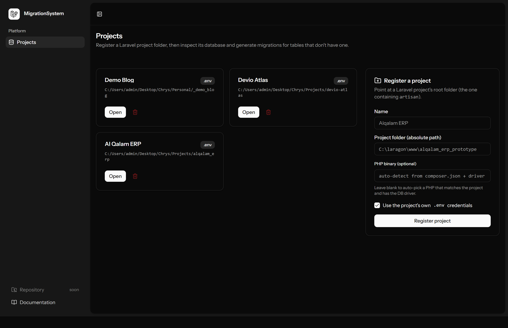
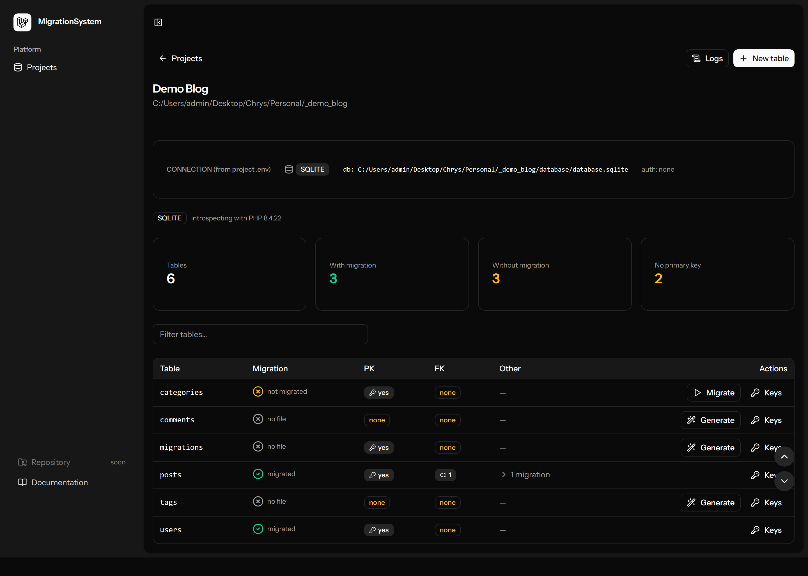
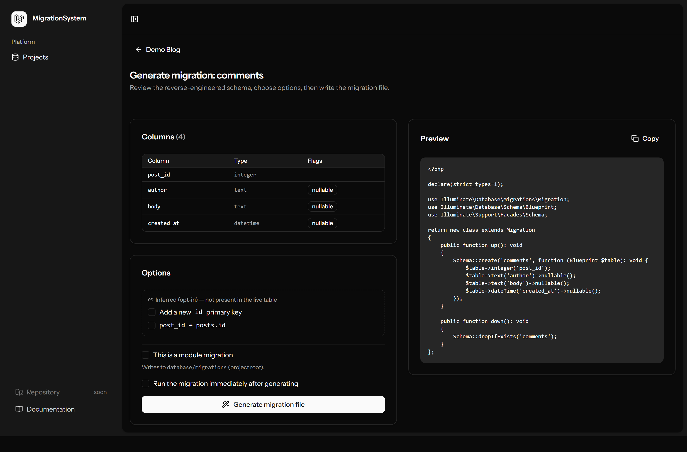
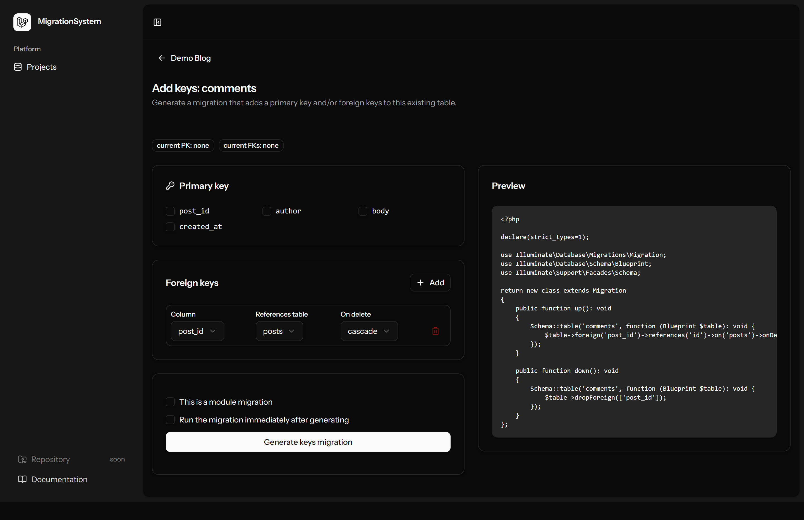
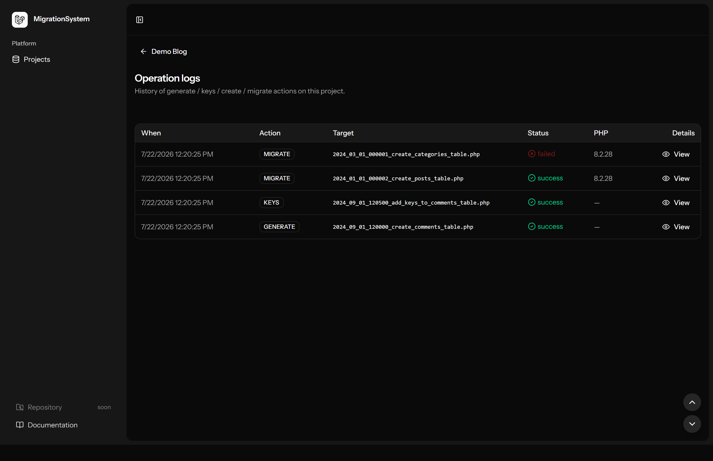
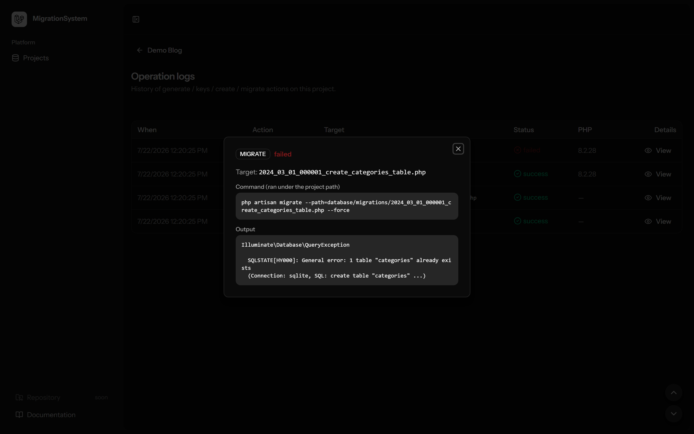

# MigrationSystem

A local developer tool for **managing Laravel database migrations across your own projects** —
inspect a project's live database, generate migrations from existing tables, design new tables,
add primary/foreign keys, and run migrations. Every action runs **under each target project's
own path and configuration**.

> **Scope: migrations only.** MigrationSystem creates, updates, generates, and runs *migrations*.
> It does **not** modify a project's application code, configuration, or requirements. It is a
> productivity tool for developers working on their own Laravel projects.

Built by **Chrysanly John Roma**. Feedback and suggestions are welcome — see
[Contributing & feedback](#contributing--feedback).

> **🚧 Status: in active development (v1).** This is a work in progress and evolving.
> **Next up (v2):** generate Eloquent **models and their relationships** from a project's
> schema, plus **migrations for those models** — see [Roadmap](#roadmap).

---

## Screenshots

| Projects | Project overview |
| --- | --- |
|  |  |

| Generate from an existing table | Add primary / foreign keys |
| --- | --- |
|  |  |

| Operation logs | Log detail (diagnose failures) |
| --- | --- |
|  |  |

_(Screenshots use a neutral demo project; no real project data is shown.)_

---

## What it does

- **Register a project** by its folder path; the connection is read from *that project's* `.env`.
- **Inspect** the live database: list tables and, per table, show whether a create-migration
  exists and whether it has actually been **migrated** (recorded in the `migrations` table),
  plus primary-key / foreign-key presence and any related (modify/drop/rename) migrations.
- **Generate** a migration from an existing table (faithful columns, types, keys, indexes;
  optional inferred primary/foreign keys).
- **Design** a brand-new table (columns, required primary key, foreign keys) → `create`
  migration with real `up()` and `down()`.
- **Add keys** (primary/foreign) to an existing table via an `add-keys` migration with a
  reversible `down()`.
- **Migrate** a specific migration file, with confirmation, a loading state, and a result toast.
- **Logs** — every operation is recorded with its command and full output for review/diagnosis.

Supported databases: **MySQL / MariaDB, SQL Server (`sqlsrv`), PostgreSQL, SQLite** — whenever an
installed PHP binary provides the matching PDO driver.

---

## Rules

1. **Migrations only.** The tool never edits application code, config, or dependencies of a
   target project. It writes migration files and runs the project's own `artisan`.
2. **Everything runs under the target project's path and its own `.env`/config.** The tool's own
   environment is never imposed on a project (its `DB_*` / `APP_*` env vars are stripped from the
   child process so the project's `.env` always wins).
3. **Confirm before writing or executing.** Generating a file and running a migration each
   require an explicit confirmation.
4. **Reversible by default.** Generated migrations include a real `down()` so they can be rolled
   back.
5. **Per-project isolation.** Each project may use a different database engine and PHP version;
   the resolved connection is shown before any action.

## Security

- **No arbitrary command execution.** Only `php artisan migrate --path=<file> --force` is run,
  from the project root. The file path is rebuilt server-side from a validated file name — it is
  never taken as a raw path from the client (no path traversal, no shell injection).
- **Credentials are never exposed.** Passwords read from a project's `.env` are used only to
  connect and are never shown in the UI or logs.
- **Read-only introspection.** Schema reading uses a standalone, framework-agnostic script; it
  does not boot or alter the target application.
- **Local, single-user tool.** It is intended to run on a developer's machine against their own
  projects. It has no built-in authentication and should **not** be exposed to a public network.
- **Migrations change live databases.** Running a migration is a real, potentially destructive
  operation. Always review the preview and keep backups. Use against production only with care.

To report a security concern, please open a private channel with the maintainer rather than a
public issue.

---

## Requirements

- PHP 8.3+ (for the tool itself) and Composer
- Node.js + npm
- One or more installed PHP binaries with the PDO drivers your target projects need
  (e.g. `pdo_sqlsrv` for SQL Server). Herd and Laragon binaries are auto-discovered.

## Getting started

```bash
composer install
npm install
cp .env.example .env
php artisan key:generate
php artisan migrate      # creates the tool's own tables (projects, operation_logs)
composer dev             # or: npm run dev + php artisan serve
```

Open the app, register a project by its folder path, and go.

---

## Roadmap

MigrationSystem is a work in progress. Planned:

- **v2 — Models & relationships.** Generate Eloquent models and their relationships
  (hasMany / belongsTo / belongsToMany, etc.) from a project's schema, and generate the
  **migrations for those models**.
- Further ideas (later): "migrate all pending" per project, rollback, and a connection test.

Have a suggestion? Open an issue — feedback is welcome.

### Releasing (maintainer)

Cut a new version in one command — it bumps `VERSION`, commits, tags, and pushes
(and publishes the GitHub Release if the `gh` CLI is installed):

```bash
composer release 1.1.0
```

Then publish the Release on GitHub if `gh` isn't installed (repo → Releases → draft
from the new tag). Installs on older versions will be prompted to update.

## Contributing & feedback

This is a personal project and is **open to feedback and suggestions**. Please:

- Open an issue for bugs or ideas, or start a discussion.
- Keep reports focused and reproducible.
- Be respectful — this is a solo, best-effort project maintained in spare time.

Pull requests are welcome but may be reviewed slowly.

---

## Credits & disclaimer

- Built with [Laravel](https://laravel.com), [Inertia.js](https://inertiajs.com), React, and
  Tailwind CSS, starting from Laravel's official React starter kit.
- **Not affiliated with, sponsored by, or endorsed by Laravel, the Laravel team, or any database
  vendor.** "Laravel" and other names are trademarks of their respective owners and are used only
  to describe compatibility.
- Provided **as is, without warranty of any kind**. You are responsible for the databases and
  projects you point it at. Always keep backups.

## License

Released under the [MIT License](LICENSE). © 2026 Chrysanly John Roma.
